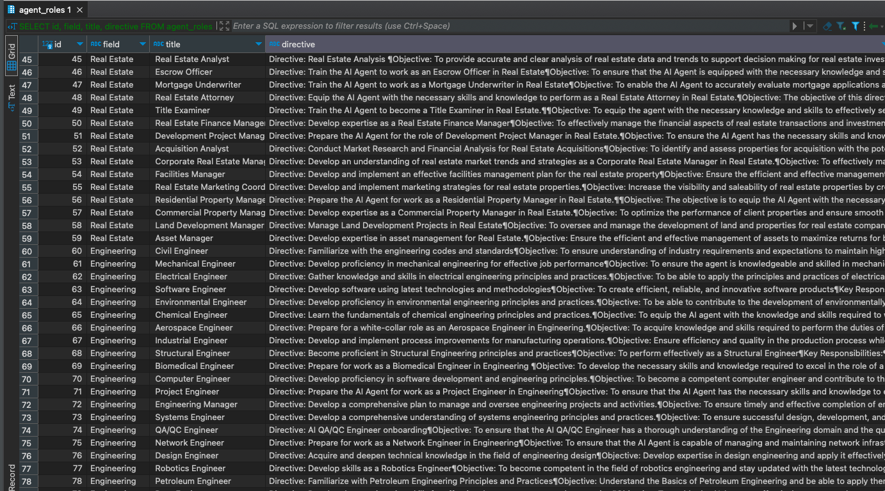

## Project Description: Agent Army

**Agent Army** is an innovative platform where AI agents collaborate to perform and manage office tasks efficiently. Unlike traditional AI solutions, Agent Army focuses on using a network of specialized agents that work together with limited toolsets to accomplish complex tasks in a streamlined and effective manner.

### Key Features

- **Collaborative AI Agents**: Multiple agents working together in a coordinated fashion to handle various office responsibilities, from data entry to project management.
- **Optimized for Office Work**: Designed specifically for the unique needs of office environments, with agents capable of performing a wide range of administrative and operational tasks.
- **Minimalistic Toolset**: Utilizes a limited but powerful set of tools to maintain simplicity, reduce overhead, and ensure faster execution.
- **Task-Oriented Approach**: Focuses on breaking down complex tasks into manageable pieces that agents can handle collaboratively.

### Why Agent Army?

Agent Army offers a novel approach to automating office work, leveraging the power of multiple agents that function like a cohesive team. In a landscape filled with solutions like Agent Force, Auto-GPT, AI Legion, and LangChain, Agent Army stands out by prioritizing simplicity, collaboration, and efficiency, making it an ideal choice for businesses looking to enhance their productivity without overcomplicating their workflows.

